# L×Box

[](https://github.com/Leadaxe/LxBox)
[](LICENSE)
[](https://github.com/Leadaxe/LxBox/releases)
[](https://dart.dev/)

Android VPN client powered by [sing-box-lx](https://github.com/Leadaxe/sing-box-lx) — a [sing-box](https://sing-box.sagernet.org/) fork with AmneziaWG 2.0, native XHTTP and MASQUE. Multi-subscription, smart routing, built-in speed test.

**[Download latest release](https://github.com/Leadaxe/LxBox/releases/latest)** | **[Документация на русском](README_RU.md)**

---

## Screenshots

<p align="center">
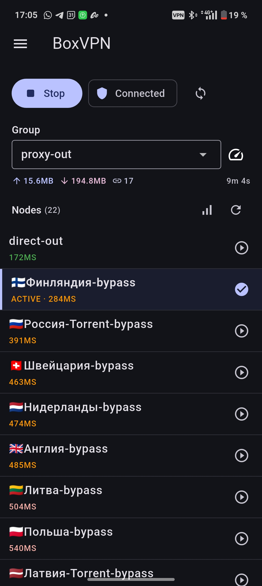
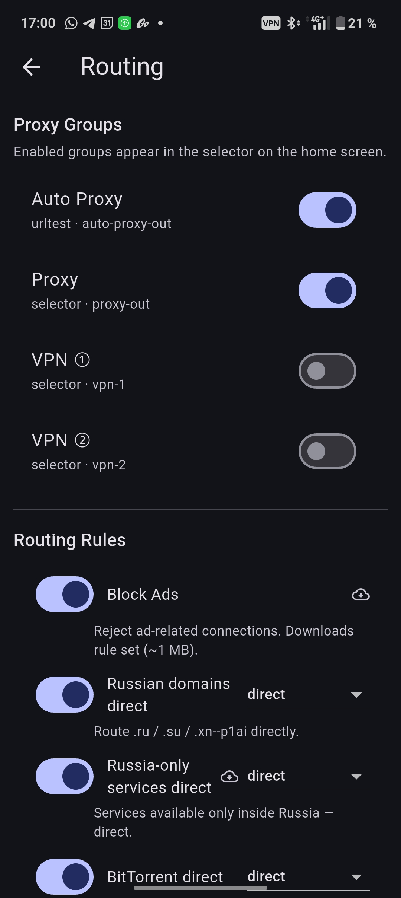
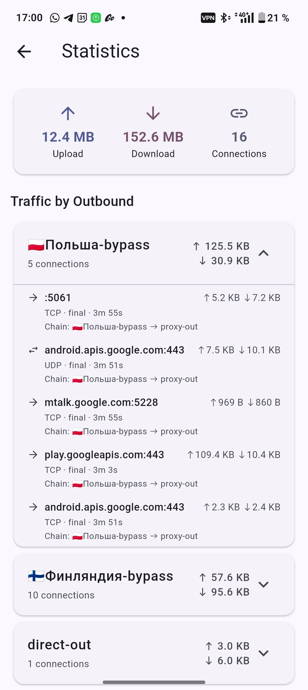
</p>
<p align="center">
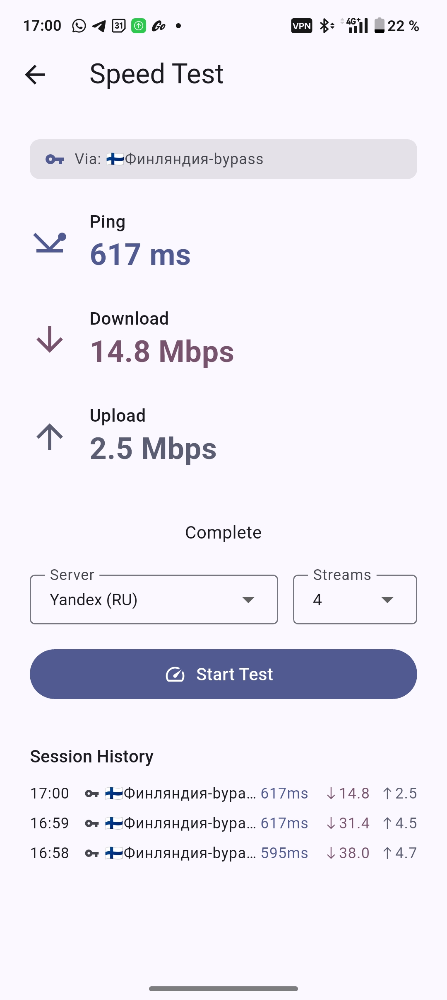
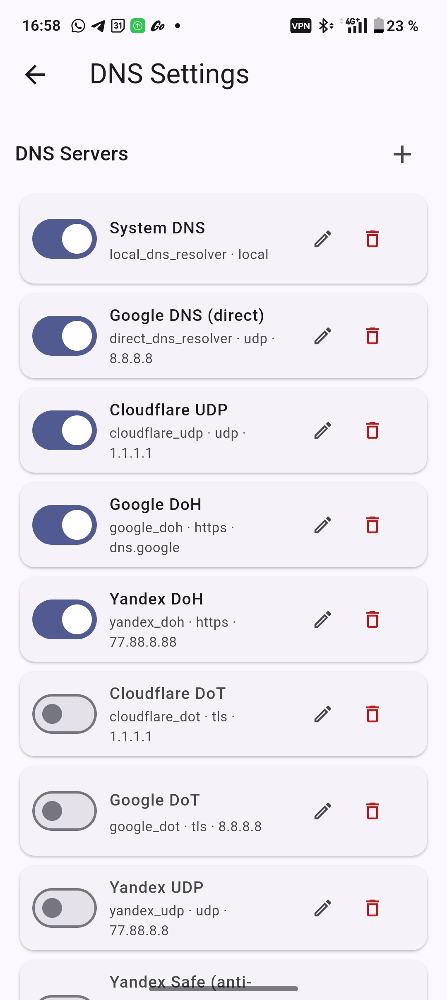
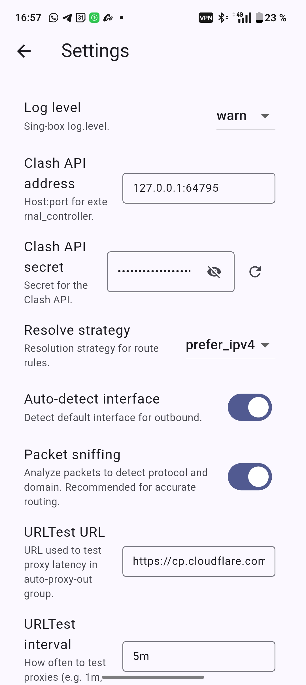
</p>
<p align="center">
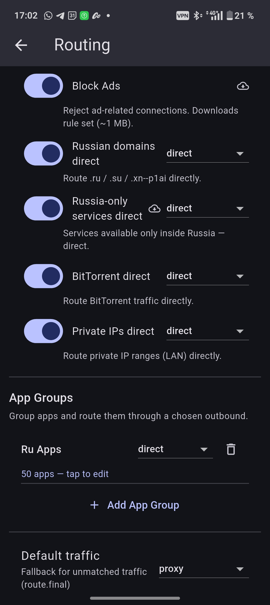
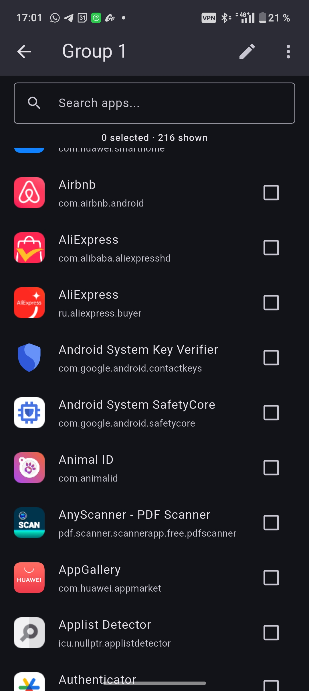
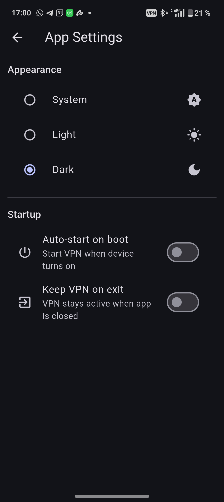
</p>
<p align="center">
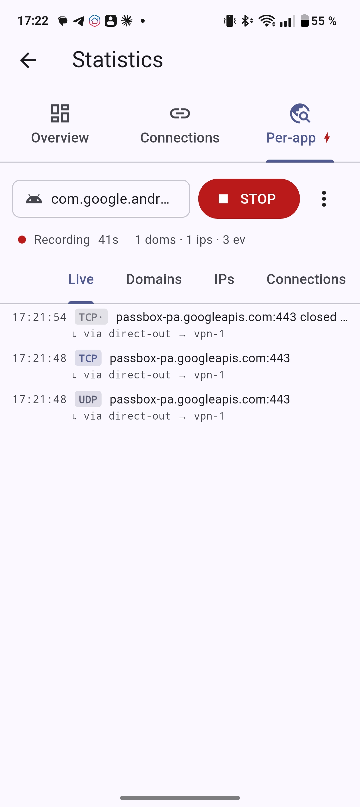
</p>

---

## Features

<details>
<summary><strong>Servers & Subscriptions</strong> — manage proxy sources in one place</summary>

Add servers by subscription URL, direct proxy link, WireGuard URI/INI, Amnezia `vpn://` link, or raw sing-box JSON outbound. Smart-paste dialog auto-detects format and previews the content. Enable/disable subscriptions without deleting. Offline rehydrate — nodes restored from body cache after app restart. Per-subscription settings for detour servers.

- **10 protocols**: VLESS, VMess, Trojan, Shadowsocks, Hysteria2, **TUIC v5**, **NaïveProxy**, SSH, SOCKS, WireGuard (incl. **AmneziaWG / AWG 2.0** — `awg://` URI, AmneziaWG `.conf`, **Amnezia `vpn://` links** (v2.0.3), JSON)
- Formats: Base64, Xray JSON Array (chained proxy), plain text, raw sing-box JSON
- Per-subscription **Update interval** picker (1/3/6/12/24/48/72/168h), honors `profile-update-interval` header
- Subscription row subtitle: `124 nodes · 🔄 24h · 🕐 3h ago · (2 fails)`
- Title fallback from `Content-Disposition: filename=...` (RFC 5987)
- Quick Start with built-in free VPN preset
- **Get WARP** — one-tap Cloudflare WARP: registers a device on Cloudflare and adds a ready WireGuard node
</details>

<details>
<summary><strong>Get WARP</strong> — one-tap Cloudflare WARP, keys generated on-device</summary>

Tap **Get WARP** in the Servers overflow menu → a WireGuard tunnel to Cloudflare is registered and added as a node. No copy-pasting configs from third-party generator sites.

- **On-device registration**: the X25519 private key is generated on the phone and never leaves it — only the public key is sent to Cloudflare (`api.cloudflareclient.com`). We don't use third-party generator workers (they hand out a server-generated private key).
- **WARP+** (optional): paste a license key under *Advanced* to bind WARP+ (Argo Smart Routing). Empty = free WARP.
- **Idempotent**: re-tapping reuses the cached account instead of registering a new device; *Re-register* forces a fresh one.
- Custom endpoint under *Advanced* (use a working `IP:port` if the default is blocked).
- See [spec 025](docs/spec/features/025%20warp%20integration/spec.md)
</details>

<details>
<summary><strong>Subscription auto-update</strong> — 4 triggers, hard gates against spam</summary>

Subscriptions refresh in the background without spamming providers. Every request is gated; nothing runs off the rails.

- **Triggers**: app start · 2 min after VPN connected · every hour · immediately on VPN disconnected · manual ⟳ (force)
- **Gates**: `minRetryInterval=15min` (persists via `lastUpdateAttempt`), `maxFailsPerSession=5` (in-memory, thaws on app restart), `10s ± 2s` between subs, `_running`/`_inFlight` dedup flags, `inProgress` guard against double-clicks
- Crash-safe init sweep: stuck `inProgress` on disk resets to `failed`
- Rebuild config **never** triggers HTTP — only local assembly from loaded nodes
- See [spec 027](docs/spec/features/027%20subscription%20auto%20update/spec.md)
</details>

<details>
<summary><strong>Home Screen</strong> — connect and manage nodes</summary>

One-tap VPN start/stop with animated status chip. Choose proxy group, sort nodes by ping/name/manual order, mass-ping all servers. Traffic bar shows real-time speed, connections count, uptime.

- **Node row layout** (v1.3.1+): `[ACTIVE green pill] PROTOCOL · · · 50MS →` — protocol label (VLESS/Hy2/WG/TUIC/SS) from outbound type, ping right-aligned with colour by latency
- **Node subtitle `PROTOCOL · transport · security`** (v2.0.0): `VLESS·xhttp·TLS`, `VLESS·tcp·Reality+Vision`, `WG·awg2` — see what's inside a node without opening JSON
- **Filter workspace** (v2.0.0): filter panel with **Regex · Protocol · Subscribes · Settings** tabs + active-filter summary chips; each category has its own `!` inversion (NOT); transport/security chip row (`tcp`/`ws`/`grpc`/`h2`/`httpupgrade`/`quic`/`xhttp` + `TLS`/`Reality`/`+Vision`/`awg`/`awg2`); filters remembered per channel
- **Detour filter — tri-state** (v2.0.0): show all / hide detours / **detours only** (clean relay-list diagnostics)
- **Custom sort persisted** (v2.0.0): manual order selectable from the sort menu and the tap-carousel (Default → Ping → A-Z → Custom), survives restart; subscriptions drag-reorder by grab-strip
- Proxy groups: `auto-proxy-out`, VPN ①/②/③
- Node filter: choose which nodes participate in auto-selection
- Sticky restart warning under Stop — doesn't disappear when you cancel Stop dialog
- Long-press: Ping · Use this node · View JSON · **Copy URI** (vless://, awg://, etc) — Copy-JSON actions live inside the View JSON dialog (Copy server / Copy detour / Copy server + detours(N))
</details>

<details>
<summary><strong>Quick Connect</strong> — toggle VPN without opening the app (v1.5.0)</summary>

Two paths to flip the VPN on/off without launching the UI: a Quick Settings tile in the status-bar shade and a long-press shortcut on the home-screen icon.

- **Quick Settings tile** — pull down the shade, edit tiles, drag **L×Box** in. Tap = on/off, live `Connected` / `Disconnected` / `Connecting…` / `Stopping…` subtitle. Add via App Settings → General → Quick connect → `Add` (system prompt on Android 13+, manual instructions on older).
- **Home-screen shortcut** — long-press the icon → **Toggle VPN**.
- First tap shows a one-shot toast and flashes `MainActivity` for the system VPN consent dialog (Android API requires Activity context); subsequent taps go directly to the service. After consent the activity finishes itself — no UI flash on regular use.
- Tile state survives OOM-kill of the service: `currentStatus` is reset on `onDestroy` so the tile won't lie «Connected».
</details>

<details>
<summary><strong>Routing</strong> — unified rule model (v1.4.0)</summary>

Block ads, route Russian domains directly, send BitTorrent through specific proxy, route per-app, match private IPs. Every user rule goes through a single `CustomRule` model with all match fields in parallel (OR within category, AND across — per sing-box default rule formula).

- **4 tabs**: Channels (proxy groups) · Presets (read-only catalog → Copy to Rules) · Rules (your registry) · Tunnel apps (OS-level split-tunneling — see below)
- **Match fields**: domain, domain_suffix, domain_keyword, ip_cidr, port, port_range, packages (per-app), protocols (tls/quic/bittorrent/…), ip_is_private, **wifi_ssid / wifi_bssid** (v1.7.3), remote .srs rule-set
- **SRS local-only** — no auto-update, manual download via ☁ icon, rule disabled until cached
- **Drag-reorder** + **long-press → Delete with confirm**
- **Params / View tabs** in rule editor — View shows live sing-box config preview
- **Dirty-aware save** — unsaved back → "Discard changes?" dialog
- Default traffic fallback (`route.final`)
- See [spec 030](docs/spec/features/030%20custom%20routing%20rules/spec.md), [spec 011](docs/spec/features/011%20local%20ruleset%20cache/spec.md), [spec 051](docs/spec/tasks/051-custom-rule-wifi-conditions.md)
</details>

<details>
<summary><strong>Load balancing</strong> — spread traffic across a pool of servers (v2.7.0)</summary>

A channel's **auto** group can do more than pick the single fastest node. Switch it to **Load balance** and it spreads new connections across a **pool** of N servers (round-robin), while keeping sessions sticky to their server so TLS/auth don't bounce between IPs.

- **Two modes** in the channel editor → *Include auto*:
  - **Fastest** (`least_test`) — one best node by latency, all traffic through it (the classic behaviour)
  - **Load balance** (`round_robin`) — connections rotate across a fixed-size pool of live nodes
- **Pool size** — how many nodes sit in the pool at once; **Pool tolerance** — `0` keeps the pool full (speed-agnostic), `>0` evicts slower nodes in favour of faster ones
- **Sticky session by** — chip row (`process` / `domain` / `source ip` / `dest ip` / `dest port`); a key like `process + domain` makes every connection of one app to one site land on the **same** pool server (zero reconnects while that node lives). Clear all chips → pure rotation, no stickiness
- **View pool** — long-press the auto node → popup with the live pool: fixed `slot · node · delay`, so you see exactly which N servers are carrying traffic right now
- Built on sing-box-lx **SPEC 019** (fixed slots, lazy health-check, slot-hash stickiness — no per-connection state). The builder only emits the `balancer{}` block under round_robin; Fastest stays byte-for-byte upstream
- See [§208 spec](docs/spec/tasks/208-urltest-balancer-round-robin.md)
</details>

<details>
<summary><strong>Wi-Fi-aware routing</strong> — different rules on different networks (v1.7.3)</summary>

Declare rules like *"on this Wi-Fi → direct"* persistently — no temporary `PUT /config` hacks. Rules with `wifi_ssid` / `wifi_bssid` AND-combine with all other match fields:
- `wifi_ssid: [HomeWiFi] → direct` — bypass VPN at home
- `wifi_ssid: [OfficeWiFi] AND domain: [*.bank.com] → direct` — banking only on office network
- `rule_set: [geosite-ru] AND wifi_ssid: [HomeWiFi] → ru-direct` — country-specific routing per Wi-Fi

Editor UI in the rule editor: chips with **Add current** (read live SSID), **Pick saved** (history of visited networks), **Manual** (type SSID or paste BSSID). Permission gates wired in (Android 13+ requires `NEARBY_WIFI_DEVICES`; sing-box also needs `ACCESS_BACKGROUND_LOCATION` to read SSID from a foreground-service VPN).

- **Auto-record opt-in** (App Settings → Diagnostics): `WifiNetworkObserver` listens to `ConnectivityManager.NetworkCallback` and writes a network into `wifi_history` only if you've stayed on it ≥5 minutes. Privacy default — off; turn on to populate the **Pick saved** picker without manual input.
- **History capped at 50 entries** (LRU evict). Manageable via `GET/POST/DELETE /wifi_history` Debug API for tests / restore.
- See [spec 051](docs/spec/tasks/051-custom-rule-wifi-conditions.md), [feature highlight](docs/features/wifi-aware-routing.md)
</details>

<details>
<summary><strong>Detour Servers</strong> — chain proxies for extra privacy</summary>

Build multi-hop chains: your traffic goes through an intermediate server before reaching the final proxy. Great for bypassing geo-restricted networks: put your home WireGuard as a detour → foreign mobile internet becomes a tunnel to home.

- Add your own server (paste URI / paste JSON / WG INI) — it becomes a candidate for detour
- **Mark as detour server** switch in Node Settings — adds `⚙ ` prefix
- **Override detour** per subscription: route all its nodes through your chosen server
- Register / Use toggles for detour servers from subscriptions
- Detour dropdown in Node Settings persists via `overrideDetour` (no JSON roundtrip drift)
</details>

<details>
<summary><strong>DNS Settings</strong> — full control over name resolution</summary>

16 DNS server presets (Cloudflare, Google, Yandex, Quad9, AdGuard) with UDP/DoT/DoH variants. Custom servers via JSON editor. Strategy, cache, rules — all configurable.

- Enable/disable servers with switches
- DNS Strategy: prefer_ipv4 / prefer_ipv6 / ipv4_only / ipv6_only
- DNS Rules editor, DNS Final, Default Domain Resolver
- Bundle preset "Russian domains direct" (spec 033) — self-contained `.ru/.su/.рф/.рус/.москва/.moscow/.tatar/.дети/.онлайн/.сайт/.орг/.ком` rule + own Yandex DNS servers + `@out`/`@dns_server` vars
</details>

<details>
<summary><strong>DPI Bypass</strong> — bypass censorship</summary>

Three orthogonal tricks — combinable on the same outbound.

- **TLS Fragment** — splits ClientHello over TCP segments
- **TLS Record Fragment** — splits handshake into multiple TLS records
- **Mixed-case SNI** (v1.3.0+) — randomises `server_name` case (`WwW.gOoGle.CoM`). Bypasses naive exact-match DPI used by regional providers. Per RFC 6066 SNI is case-insensitive; the trick doesn't change server behaviour. Ineffective against GFW-class filtering.
- All tricks applied to first-hop only (inner hops are inside the tunnel, local DPI doesn't see them).
- See [spec 020](docs/spec/features/020%20security%20and%20dpi%20bypass/spec.md), [spec 028](docs/spec/features/028%20antidpi%20sni%20obfuscation/spec.md)
</details>

<details>
<summary><strong>Haptic Feedback</strong> — vibro on VPN events</summary>

Short vibration on VPN transitions, errors, and taps. Respects the Android system Touch feedback setting.

- Tap Start/Stop → light tick
- VPN connected → medium impact; user disconnect → light
- Revoked / heartbeat fail (first only, not per tick) → heavy
- Manual subscription fetch success/fail → light/medium
- Auto triggers don't vibrate; 100 ms throttle prevents spam
- Toggle in App Settings → Feedback (default **on**)
- See [spec 029](docs/spec/features/029%20haptic%20feedback/spec.md)
</details>

<details>
<summary><strong>Speed Test</strong> — measure your connection</summary>

Built-in speed test with 10 servers worldwide. Per-server ping measures latency to the actual download server. Parallel download streams, upload test, session history.

- Servers: Cloudflare, Hostkey (5 cities), Selectel, Tele2, OVH, ThinkBroadband
- Configurable streams (1/4/10), upload method per server
- Session history with server name
</details>

<details>
<summary><strong>Statistics & Connections</strong> — see what's happening</summary>

Real-time traffic by outbound with expandable cards. Each connection shows host, protocol, routing rule, traffic, duration, proxy chain, and app/process name. Close individual connections.

- **4 tabs**: Overview · Connections · Per-app · **Live** (system-wide, v1.7.2)
- **Live tab** — discovery without picking a target: see every TCP/UDP open and DNS resolve happening on the device in real time. Filter chips (kind / unattributed-only / app multi-select / domain-IP-process search), pause/resume, long-press → "Open in Per-app session for &lt;pkg&gt;" quick-discovery flow. 60s rolling buffer × 3000 events. Inline `CoreLogsHintBanner` appears when `Forward sing-box logs` is off (without it DNS resolves and process attribution don't reach the buffer)
</details>

<details>
<summary><strong>Per-app traffic profiler</strong> — trace any app's network in real time (v1.7.0)</summary>

<p align="center">
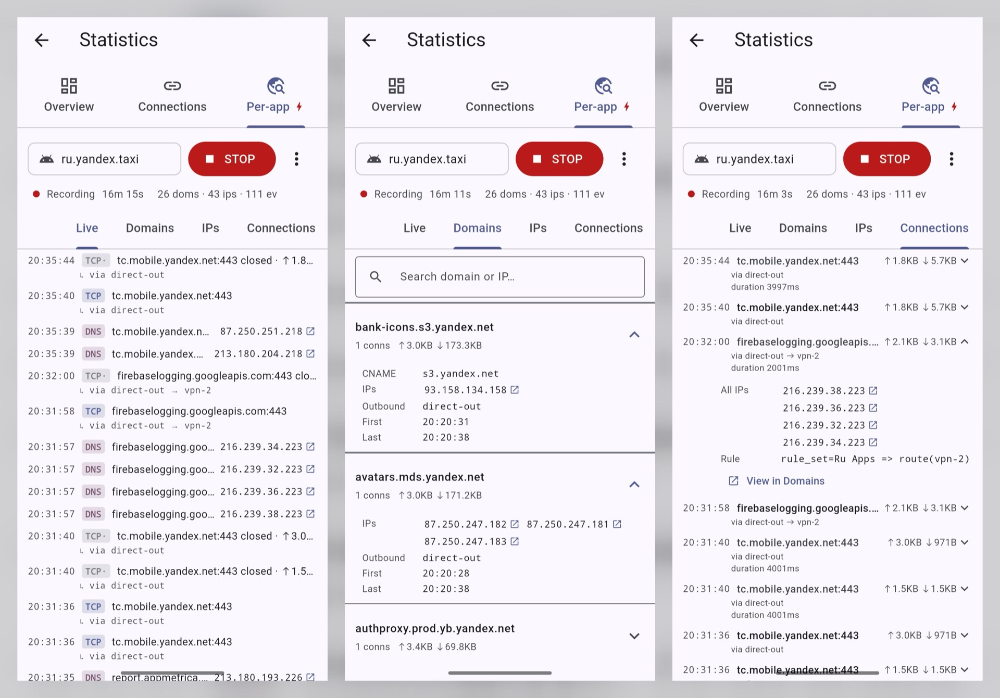
</p>

Pick an app, hit ▶ Record, and see every domain, IP, and routing decision — including which CDN your bank uses, where it gets routed, and whether part of the traffic leaks through a different outbound. Built-in connection-issue detection flags failed DNS and likely-blocked TCP connections.

- **Stats → Per-app tab**: select package via app picker, [▶ START] / [⏹ STOP], status row shows `Recording 02:34 · 47 doms · 53 ips · 287 ev`
- **4 sub-tabs**:
  - **Live** — newest events first (DNS resolves with CNAME chain · TCP/UDP open/close), monospace IP `↗` chip jumps to Domains
  - **Domains** — aggregated unique domains, sortable; expanded view = CNAME targets, all resolved IPs, outbounds, issues. Search field matches by `domain` || `ip` || `cname target` (cross-domain CDN audit)
  - **IPs** — aggregated by destination IP (ports, conn count, bytes, outbound). Each row has `↗` to jump back to Domains filtered by that IP
  - **Connections** — per-connection timeline. Tap header to inline-expand: CNAME chain, all IPs, rule, issues, button `[View in Domains →]` that focuses the corresponding aggregate row
- **Connection-issue detection (2 locale-agnostic types)**: `dnsTimeout` (sing-box `dns: exchange failed` log — direct engine signal, not heuristic), `tcpReset` (TCP closed within 1s with 0 bytes — likely firewall RST / unreachable). ⚠ icon on Live row + Domain expanded view shows full description
- **Process inference** — when sing-box's `find_process` misses (rare with WebView/system processes), profiler attributes connection by recently resolved IP within a 10s post-DNS window; rows marked `〽 inferred from prior DNS`
- **Recording indicators**:
  - HomeScreen `_buildTrafficBar` chip `⚡ <pkg>` next to traffic stats; tap whole row → `StatsScreen(initialTab: perApp)`
  - Stats `Per-app` tab title gets red `⚡` while recording
- **Overflow menu (⋮)** in Per-app tab: Verbose core logs (debug-level, applies on next session), Copy session JSON, Share, Clear all sessions, Help
- **In-memory only** — last 5 finished sessions kept, plus 1 active. 3h sliding window per session + 50k events fallback cap. `force-stop` / app kill wipes everything (no persist by design — diagnostic-only)
- **Debug API** (Bearer-auth, port 9269): `POST /profiler/start {package, verbose?}` · `POST /profiler/stop` · `GET /profiler/active` · `GET /profiler/sessions` · `GET /profiler/session/<id>?include=events,domains,ips` · `DELETE /profiler/session/<id>` · `DELETE /profiler/sessions` · `GET /profiler/stream` (Server-Sent Events, fire-and-forget)
- **Docs**: [user guide with use cases & curl recipes](docs/features/per-app-trace.md) · [§044 spec](docs/spec/features/044%20per-app%20traffic%20profiler/spec.md)
</details>

<details>
<summary><strong>On-device core profiling (pprof)</strong> — catch CPU spin & memory leaks (v2.7.0)</summary>

When the core runs hot or leaks memory, capture a real Go **pprof** snapshot straight from the device — no desktop, no rebuild. **App Settings → Diagnostics → Profiling**: each button pulls a profile from the live sing-box core and opens the system Share sheet.

| Profile | What it catches |
|---|---|
| **CPU profile (10s)** | overheating / 100 % CPU — busy-spin in a tight loop |
| **Heap (inuse_space)** | what actually holds memory now (GC is forced before the snapshot, so only live objects) |
| **Allocations** | what allocates memory (GC-pressure source) |
| **Goroutines** (summary / full stacks) | goroutine count and full stacks — goroutine leaks |

- `.pb` files open with `go tool pprof` (CPU/heap/allocs); `goroutine?debug=*` is plain text. Heap inuse: `go tool pprof -inuse_space heap.pb`
- Implemented entirely shell-side via libbox's built-in `PProfServer` (Go `net/http/pprof`) — **the core was not patched**. The server binds to a loopback port on tap, serves one GET, and shuts down in `finally` (no listener lingers in production)
- Also via Debug API: `GET /diag/pprof?profile=heap|profile|allocs|goroutine&query=...` (tunnel must be up)
- See [§207 spec](docs/spec/tasks/207-goroutine-cpu-dump.md)
</details>

<details>
<summary><strong>VPN Settings</strong> — tune the engine</summary>

Two tabs (v1.7.3 reorg, see [§052](docs/spec/tasks/052-vpn-settings-system-service-tabs.md)):
- **System** — Android-side `VpnService.Builder` toggles: `Allow VPN bypass` (apps using `ConnectivityManager` can step around the tun), `Keep VPN on exit` (tunnel survives app close), `Tunnel sleep mode` (`never` / `lazy` Doze-only / `always` screen-off — battery vs reliability trade-off).
- **Core** — sing-box engine vars (`chapter: 'core'` in template — `mtu` / `log_level` / `dns_final` / etc). Routing- and DNS-specific vars live on their own screens (Routing, DNS Settings).

All changes autosaved. URLTest parameters for auto-proxy latency testing. Permissions block (Battery / Notifications / Location / Wi-Fi / App info) lives in **App Settings → Diagnostics** (interactive — tap to grant).
</details>

<details>
<summary><strong>Config Editor</strong> — for power users</summary>

View and edit raw sing-box JSON config. Pretty-printed display with copy button. Save, paste from clipboard, load from file, share.
</details>

<details>
<summary><strong>App Settings</strong> — personalize</summary>

- Theme: System / Light / Dark
- Auto-start VPN on boot
- Keep VPN active when app is closed
- Auto-rebuild config on settings change
- **Battery optimization** tile — status + shortcut to system whitelist (v1.4.0)
- **App info (OEM power settings)** with hint dialog for Autostart / Background activity toggles (v1.4.0)
- **Auto-ping after connect** — ping active group 5s after VPN up (default on, v1.4.0)
- Haptic feedback toggle
- See [spec 022](docs/spec/features/022%20app%20settings/spec.md)
</details>

---

## Supported Protocols

| Protocol | URI scheme | Transport |
|----------|-----------|-----------|
| VLESS | `vless://` | TCP, WebSocket, gRPC, H2, HTTPUpgrade, **XHTTP**, REALITY |
| VMess | `vmess://` (v2rayN base64) | TCP, WebSocket, gRPC, H2, HTTPUpgrade, **XHTTP** |
| Trojan | `trojan://` | TCP, WebSocket, gRPC |
| Shadowsocks | `ss://` (SIP002 + legacy + SS2022) | TCP, UDP, SIP003 plugins |
| Hysteria2 | `hy2://` / `hysteria2://` | QUIC, Salamander obfs |
| **TUIC v5** | `tuic://` | QUIC, BBR/CUBIC/NewReno, zero-RTT |
| **NaïveProxy** | `naive+https://` | Real Chrome TLS via cronet, `extra-headers` |
| SSH | `ssh://` | TCP, host key / password / private key |
| SOCKS | `socks://` / `socks5://` | TCP, auth |
| WireGuard / **AmneziaWG** | `wireguard://`, `awg://`, INI / `.conf`, **Amnezia `vpn://`** | UDP, multi-peer, **AWG 1.x/2.0 obfuscation** (jc/jmin/jmax, s1–s4, h1–h4 incl. **`N-M` ranges**, i1–i5), auto-MTU 1280 |

**XHTTP** is a native transport since v2.0.0 (Xray splithttp: `mode` auto/packet-up/stream-up/stream-one). Since **v2.8.0** the link parser supports the **full client-side param set**: configurable session/seq/uplink placements (path/query/header/cookie), keys, upload method, **X-Padding obfs mode** (`repeat-x`/`tokenish`) and packet-up tuning — read both from flat query params and from the `extra` (URL-encoded JSON) parameter. Works with TLS and Reality, incompatible with XTLS-Vision (protocol limitation).

See [Protocol Documentation](docs/PROTOCOLS.md) for full URI format details and sing-box mapping.

---

## Architecture

L×Box is built around a **3-layer parser/builder pipeline** (spec 026, v1.3.0+):

```
UI / Controller
  │
  ▼
parseFromSource(source)  ← HTTP fetch + body_decoder + typed parser
  │                         returns: List<NodeSpec>, meta, rawBody
  ▼
ServerList (sealed)      ← SubscriptionServers | UserServer
  │ .build(ctx)            applies tagPrefix, detour policy, allocateTag
  ▼
buildConfig(lists, settings)  ← template + post-steps (DPI, DNS, rules)
  │                              returns: BuildResult{ config, validation, warnings }
  ▼
sing-box JSON
```

- **Bundled core** (v2.0.0) — [sing-box-lx](https://github.com/Leadaxe/sing-box-lx) **`v1.14.0-lx.1-rc.16`**: sing-box 1.14 fork built with `with_awg` / `with_xhttp` / `with_lx_command` tags; the control channel runs over libbox `CommandClient` (no Clash API). Adds the round-robin **load-balancer** (SPEC 019) + `GetPool` RPC, and the full XHTTP client param set (SPEC 002 v2, rc.16). Version pinned in `app/android/libbox.version`, AAR fetched from the fork's GitHub Releases by `scripts/fetch-libbox.sh` with SHA256 verification
- **Sealed `NodeSpec`** — 9 protocols, polymorphic `emit(vars)` / `toUri()` (round-trip invariant)
- **`EmitContext`** — passes template vars into per-node emit
- **`NodeEntries{main, detours[]}`** — named struct for chain results
- **`ValidationResult`** — typed issues: dangling refs, empty urltest, invalid selector default

See [Architecture](docs/ARCHITECTURE.md) for the full picture.

---

## Development

Spec-driven development — 30 feature specifications document every capability.

| Document | Description |
|----------|-------------|
| [Security](docs/SECURITY.md) | Threat model — traffic-leak protection (Unknown traffic / kill-switch), local attack surface, on-device secrets |
| [Protocol Reference](docs/PROTOCOLS.md) | URI formats, parameters, sing-box mapping |
| [Architecture](docs/ARCHITECTURE.md) | 3-layer pipeline, data flows, native bridge |
| [Build](docs/BUILD.md) | Build instructions, CI, APK signing, local-build marker |
| [Development Guide](docs/DEVELOPMENT_GUIDE.md) | Principles, testing (167 tests), spec organisation |
| [Changelog](CHANGELOG.md) | Release history |
| [Release Notes](docs/releases/) | Detailed per-version notes (EN + RU) |

### Local build

```bash
./scripts/build-local-apk.sh
```

The script wraps `flutter build apk --release` with `--dart-define`s that embed git describe info. About screen shows a pink **🧪 LOCAL BUILD · N commits since vX.Y.Z** badge to distinguish from CI builds.

---

## License

L×Box is licensed under the [GNU General Public License v3.0](LICENSE).

Commercial licensing from Leadaxe may be available for **Leadaxe's own code in L×Box**. Note that L×Box links against [`libbox`](https://github.com/SagerNet/sing-box) (sing-box, GPLv3), so any compiled L×Box build remains under GPLv3 regardless — a Leadaxe-only commercial license cannot authorize embedding L×Box into a proprietary product. Scope and limits: [LICENSING.md](LICENSING.md). Inquiries: [ledaxe@gmail.com](mailto:ledaxe@gmail.com).
