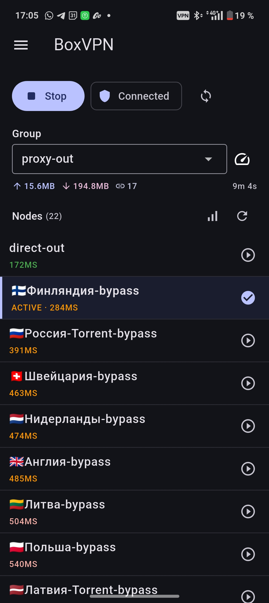
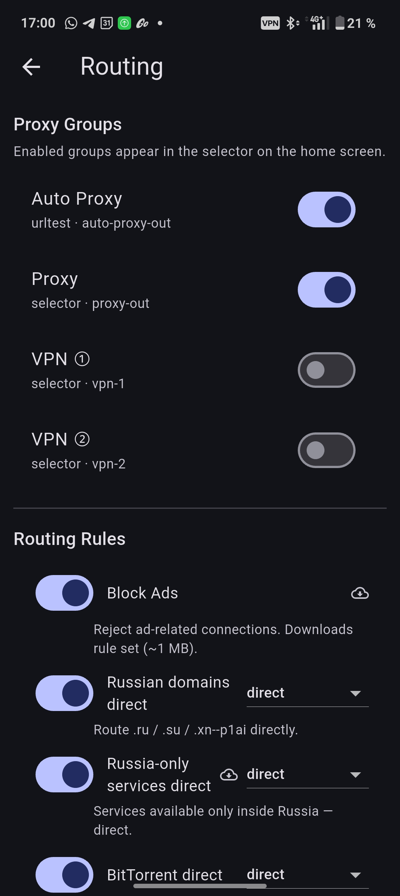
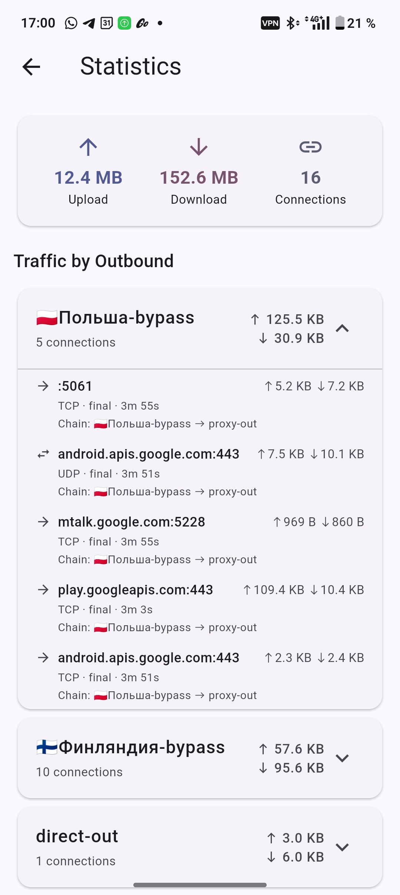
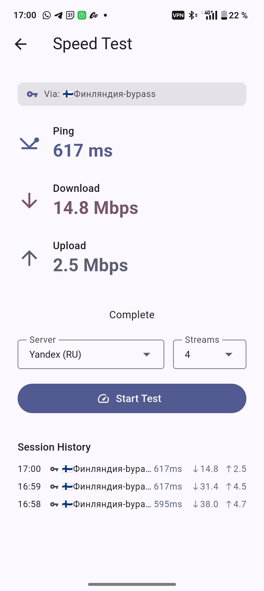
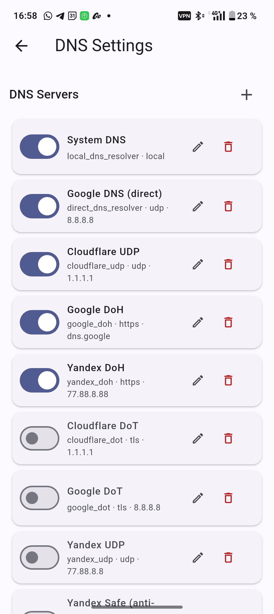
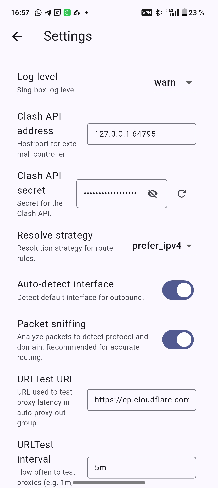
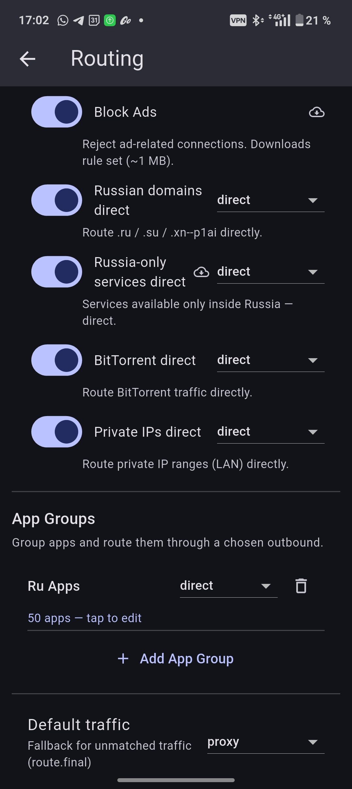
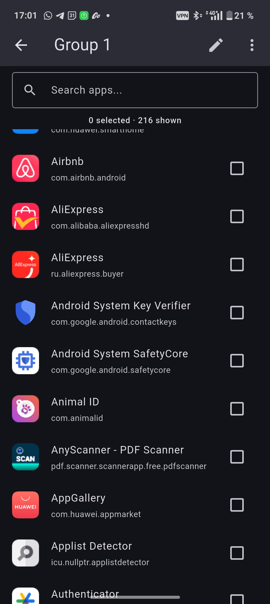
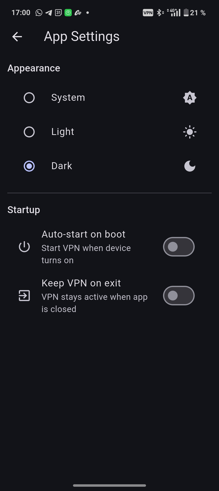

# BoxVPN

Android VPN-клиент на базе [sing-box](https://sing-box.sagernet.org/). Мульти-подписки, умная маршрутизация, встроенный тест скорости.

**[Скачать последний релиз](https://github.com/Leadaxe/BoxVPN/releases/latest)**

---

## Скриншоты

<p align="center">



</p>
<p align="center">



</p>
<p align="center">



</p>

---

## Возможности

### Подписки
- Добавление подписок по URL или прямой ссылке на прокси
- Поддерживаемые протоколы: **VLESS, VMess, Trojan, Shadowsocks, Hysteria2, SSH, SOCKS, WireGuard**
- Форматы: Base64, Xray JSON Array (с поддержкой chained proxy/jump), plain text
- **Включение/отключение** отдельных подписок без удаления
- Автообновление при запуске VPN (настраиваемый интервал)
- Имя профиля и статистика трафика из HTTP-заголовков (subscription-userinfo)
- Детальный экран подписки: список нод, полоса квоты трафика, срок действия, ссылки на поддержку
- **Офлайн-кэширование**: подписки кэшируются на диск, работают без интернета
- Быстрый старт: встроенный пресет бесплатного VPN
- Ссылки на Telegram-поддержку открываются нативно

### Главный экран
- **Старт/Стоп** VPN одной кнопкой
- Выбор группы (proxy-out, auto-proxy-out, vpn-1, vpn-2)
- Список нод с сортировкой по **Пингу**, **A-Z** или **по умолчанию**
- Активная нода выделена галочкой
- Панель трафика: скорость загрузки/отдачи, количество соединений, аптайм
- Тап по панели трафика → **Статистика**
- **Массовый пинг**: параллельный пинг всех нод (20 одновременно)
- Долгое нажатие на кнопку пинга → **Настройки пинга** с пресетами URL (Google, Cloudflare, Apple, Firefox, Yandex)

### Фильтр нод (auto-proxy-out)
- Полный список нод из proxy-out с чекбоксами
- Отмеченные ноды включены в auto-proxy-out (urltest)
- Неотмеченные ноды исключены из автовыбора, но остаются в ручном селекторе
- Поиск, Выбрать все / Снять все
- Читает из конфига (офлайн, мгновенно)

### Маршрутизация
- **Группы прокси**: включение/отключение предустановленных групп (Auto Proxy, Proxy, VPN 1, VPN 2)
- **Правила маршрутизации**: Блокировка рекламы, Российские домены напрямую, Сервисы только для России, BitTorrent напрямую, Приватные IP напрямую
- **Выбор outbound** для каждого правила (direct/proxy/auto/vpn-X)
- **Группы приложений**: именованные группы приложений с маршрутизацией через выбранный outbound
  - Выбор приложений с иконками, поиск, выбрать все/инвертировать, импорт/экспорт через буфер обмена
- **Трафик по умолчанию** (route.final): fallback outbound для нераспознанного трафика
- Все изменения **сохраняются автоматически** (без кнопки Apply)

### Настройки DNS
- **16 пресетов DNS-серверов**: Cloudflare (UDP/DoT/DoH), Google (UDP/DoT/DoH), Yandex (UDP/Safe/Family/DoT/DoH), Quad9, AdGuard, варианты через VPN
- Включение/отключение серверов переключателями
- Добавление своих серверов через JSON-редактор
- **Стратегия DNS**: prefer_ipv4 / prefer_ipv6 / ipv4_only / ipv6_only
- **Независимый кэш** — переключатель
- **Правила DNS** — редактор (JSON)
- **DNS Final** и **Default Domain Resolver** — выпадающие списки из включённых серверов
- Все пресеты определены в `wizard_template.json` (единый источник настроек)

### Настройки VPN
- Уровень логирования (warn/info/debug/trace)
- Адрес и секрет Clash API (автогенерация)
- Стратегия резолва
- Автоопределение интерфейса
- Анализ пакетов (sniffing)
- **URLTest URL** — эндпоинт для тестирования латентности прокси
- **URLTest interval** — как часто тестировать (напр. 5m)
- **URLTest tolerance** — минимальная разница латентности для переключения (мс)
- TUN адрес, MTU, strict route, TUN стек
- Все изменения сохраняются автоматически

### Тест скорости
- **4 параллельных потока загрузки** (настраивается: 1/4/10)
- **Обновление в реальном времени** каждые 500мс
- Пинг: 5 измерений, усечённое среднее
- Выбор сервера: **Cloudflare, Hetzner (EU), OVH (EU), Yandex (RU)**
- Показывает текущий прокси или индикатор "Direct"
- **История за сессию** (последние 10 тестов, сохраняется пока приложение работает)
- Все настройки из `wizard_template.json`

### Статистика
- Общий upload/download и количество соединений
- **Трафик по Outbound**: раскрываемые карточки по каждой proxy-ноде
- Каждое соединение: host:port, протокол (TCP/UDP), правило, трафик, длительность, цепочка
- Тап на счётчик **Connections** → полный список соединений с кнопками закрытия

### Настройки приложения
- Тема: **Системная / Светлая / Тёмная**
- **Автозапуск при загрузке**: VPN запускается при включении устройства
- **Сохранять VPN при выходе**: VPN остаётся активным при свайпе приложения

### Редактор конфига
- Просмотр и редактирование raw JSON конфига sing-box
- Форматированное отображение
- Сохранение, вставка из буфера обмена, загрузка из файла

---

## Архитектура

```
wizard_template.json          ← Единый источник всех настроек по умолчанию
    |
    +-- dns_options            (16 DNS-серверов + правила)
    +-- ping_options           (URL, таймаут, пресеты)
    +-- speed_test_options     (серверы, потоки, ping URLs)
    +-- preset_groups          (группы прокси: auto/selector/vpn)
    +-- vars                   (все конфигурационные переменные)
    +-- selectable_rules       (правила маршрутизации с SRS)
    +-- config                 (каркас конфига sing-box)

boxvpn_settings.json          ← Пользовательские переопределения
    |
    +-- vars                   (изменённые пользователем переменные)
    +-- proxy_sources          (подписки)
    +-- dns_options            (пользовательские DNS серверы/правила)
    +-- enabled_rules          (переключатели правил маршрутизации)
    +-- excluded_nodes         (фильтр нод)
    +-- app_rules              (маршрутизация по приложениям)

ConfigBuilder.generateConfig()
    |
    1. Загрузка wizard_template
    2. Подстановка @переменных
    3. Загрузка и парсинг подписок (с fallback на дисковый кэш)
    4. Фильтрация исключённых нод (только urltest)
    5. Сборка групп прокси
    6. Применение правил маршрутизации
    7. Применение DNS серверов и правил
    8. Кэширование удалённых SRS rule sets
    9. Выход: JSON для sing-box
```

### Технологии
- **Flutter** (Dart 3.11+), Material 3
- **sing-box** нативная библиотека (libbox 1.12.12 через JitPack)
- **Clash API** для управления прокси в реальном времени
- Gradle Kotlin DSL, AGP 8.11.1, Kotlin 2.2.20, Java 17

### Структура проекта
```
app/
  lib/
    controllers/        HomeController, SubscriptionController
    models/             HomeState, ProxySource, ParsedNode, WizardTemplate
    screens/            12 экранов (home, routing, subscriptions, DNS, speed test и др.)
    services/           ConfigBuilder, SourceLoader, ClashApiClient, UrlLauncher и др.
    widgets/            NodeRow
    vpn/                BoxVpnClient (MethodChannel/EventChannel)
  android/
    app/src/main/kotlin/
      vpn/              VpnPlugin, BoxVpnService, ConfigManager
      MainActivity.kt   MethodChannel для открытия URL
  assets/
    wizard_template.json
    get_free.json
```

---

## Сборка

### Требования
- Flutter SDK 3.41+
- Java 17 (Temurin)
- Android SDK с platforms 34-36, build-tools 35, NDK 28

### Локальная сборка
```bash
cd app
flutter pub get
flutter build apk --release
```

### CI/CD
GitHub Actions workflow поддерживает:

| Триггер | Что происходит |
|---------|---------------|
| Push в `main` | Только проверки (analyze + test) |
| Push тега `v*` | Проверки + Сборка APK + GitHub Release (draft) |
| Ручной `run_mode=build` | Проверки + Сборка APK |
| Ручной `run_mode=release` | Проверки + Сборка APK + GitHub Release |

```bash
# Стабильный релиз
git tag v1.2.0
git push origin v1.2.0

# Ручная сборка
gh workflow run CI --repo Leadaxe/BoxVPN -f run_mode=build

# Ручной релиз
gh workflow run CI --repo Leadaxe/BoxVPN -f run_mode=release
```

---

## Поддерживаемые протоколы

| Протокол | URI-схема | Транспорт |
|----------|-----------|-----------|
| VLESS | `vless://` | TCP, WebSocket, gRPC, H2, REALITY |
| VMess | `vmess://` (v2rayN base64) | TCP, WebSocket, gRPC, H2 |
| Trojan | `trojan://` | TCP, WebSocket, gRPC |
| Shadowsocks | `ss://` (SIP002 + legacy) | TCP, UDP |
| Hysteria2 | `hy2://` / `hysteria2://` | QUIC |
| SSH | `ssh://` | TCP |
| SOCKS | `socks://` / `socks5://` | TCP |
| WireGuard | `wireguard://` | UDP |

---

## Спецификации фич

Каждая возможность документирована как спецификация в [`docs/spec/features/`](docs/spec/features/). Это основа подхода **spec-driven development**.

| # | Фича | Статус |
|---|------|--------|
| 001 | Мобильный стек (Android + iOS) | Готово |
| 002 | MVP Scope | Готово |
| 003 | Главный экран (группы и ноды через Clash API) | Готово |
| 004 | Парсер подписок (8 протоколов) | Готово |
| 005 | Генератор конфига (Wizard Template) | Готово |
| 006 | UI подписок и настроек | Готово |
| 007 | Редактор конфига (форматирование JSON) | Готово |
| 008 | Пинг и управление нодами | Готово |
| 009 | Тёмная тема и UX | Готово |
| 010 | Быстрый старт и автообновление | Готово |
| 011 | Локальный кэш Rule Set | Готово |
| 012 | Xray JSON Array + Chained Proxy | Готово |
| 013 | Нативный VPN-сервис | Готово |
| 014 | Детальный экран подписки | Готово |
| 015 | Выбор outbound для правил | Готово |
| 016 | Экран маршрутизации | Готово |
| 017 | Per-App Proxy (Split Tunneling) | Готово |
| 018 | Custom Nodes (ручные + override) | Спека |
| 019 | Load Balance | Спека |
| 020 | Multi-hop / Chained Proxy UI | Спека |
| 021 | Тест скорости | Готово |
| 022 | Фильтр нод (auto-proxy-out) | Готово |
| 023 | Автозапуск при загрузке | Готово |
| 024 | Статистика и соединения | Готово |
| 025 | Настройки DNS | Готово |
| 026 | Включение/отключение подписок | Готово |
| 027 | Автосохранение (без кнопок Apply) | Готово |
| 028 | Кэширование подписок (офлайн) | Готово |
| 029 | Контекстное меню подписок | Готово |
| 030 | Открытие ссылок через Intent | Готово |
| 031 | Архитектура Wizard Template | Готово |
| 032 | Настройки пинга (пресеты URL) | Готово |
| 033 | Конфигурация URLTest | Готово |
| 034 | Контекстное меню нод | Готово |
| 035 | Панель трафика и навигация | Готово |
| 036 | Режимы сортировки (Default/Ping/A-Z) | Готово |
| 037 | CI/CD Pipeline (тег → релиз) | Готово |
| 038 | Улучшения экрана подписки | Готово |
| 039 | Security Hardening | Частично |

---

## Документация

| Документ | Описание |
|----------|----------|
| [`docs/DEVELOPMENT_GUIDE.md`](docs/DEVELOPMENT_GUIDE.md) | **Как вести разработку**: принципы, риски, тестирование, работа с AI |
| [`docs/ARCHITECTURE.md`](docs/ARCHITECTURE.md) | Архитектура, потоки данных, нативный код |
| [`docs/BUILD.md`](docs/BUILD.md) | Инструкции по сборке, CI, подпись APK |
| [`docs/DEVELOPMENT_REPORT.md`](docs/DEVELOPMENT_REPORT.md) | Полная история разработки (10 этапов) |
| [`CHANGELOG.md`](CHANGELOG.md) | Список изменений по релизам |
| [`docs/spec/features/`](docs/spec/features/) | **39 спецификаций фич** (spec-driven development) |

---

## Безопасность

Подробный аудит безопасности: [spec 039](docs/spec/features/039%20security%20hardening/spec.md).

Ключевые меры:
- **Только TUN inbound** — нет SOCKS5/HTTP прокси на localhost (защита от утечки IP)
- **Clash API** на рандомном порту с обязательным секретом
- **VPN Service** не экспортирован (`android:exported="false"`)
- **Геомаршрутизация**: российские домены → direct (не через прокси)
- Secret генерируется криптографически безопасным ГПСЧ

---

## Лицензия

Уточняется.
